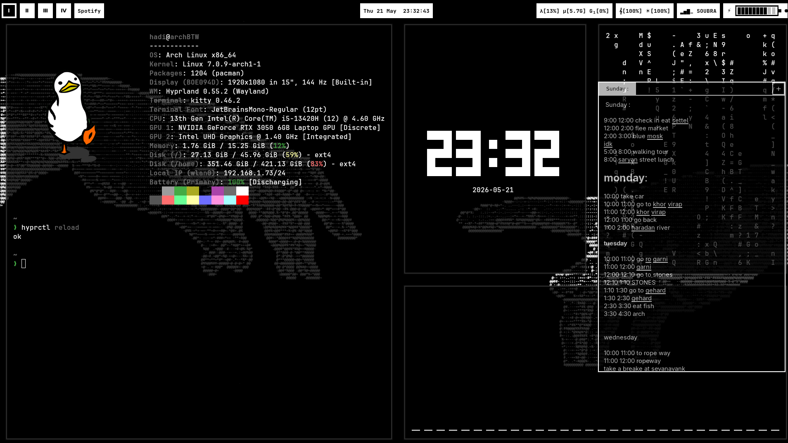

# Fast Notes

A lightweight floating notes app built with GTK3 for Hyprland/Wayland. Stays out of your way — summon it with a keybind, jot something down, dismiss it.



## Features

- Multi-tab notes with auto-named tabs from content
- Notes persist across sessions (saved to `notes.json`)
- Spell check with click-to-correct suggestions
- Text formatting: **bold**, *italic*, font size (per selection or whole note)
- Scrollable tab bar — create as many notes as you want
- Semi-transparent floating window
- Toggle open/close with a single keybind

## Requirements

- Python 3.11+
- GTK3 (`python-gobject`)
- `pyspellchecker`

```bash
pip install pyspellchecker
```

## Setup

### 1. Clone

```bash
git clone https://github.com/YOUR_USERNAME/fast-notes.git
cd fast-notes
```

### 2. Configure

Edit `config.toml` to set window size, position, and transparency:

```toml
[window]
width = 450
height = 700
title = "Fast Notes"

[window.position]
x = 1450
y = 200

[window.style]
background_opacity = 0.7
```

`x` and `y` are relative to your focused monitor.

### 3. Hyprland keybind

Add to `~/.config/hypr/hyprland.conf`:

```
bind = SUPER, N, exec, /path/to/fast-notes/toggle.sh
```

Make the script executable if needed:

```bash
chmod +x toggle.sh
```

## Usage

| Action | Result |
|---|---|
| `Super + N` | Toggle app open/close |
| Click tab | Switch note |
| `+` button | New note |
| Double-click tab | Delete note (with confirmation) |
| Scroll on tab bar | Scroll through tabs |
| Click underlined word | See spelling suggestions |
| `Ctrl + B` | Bold |
| `Ctrl + I` | Italic |
| `Ctrl + =` / `Ctrl + -` | Increase / decrease font size |
